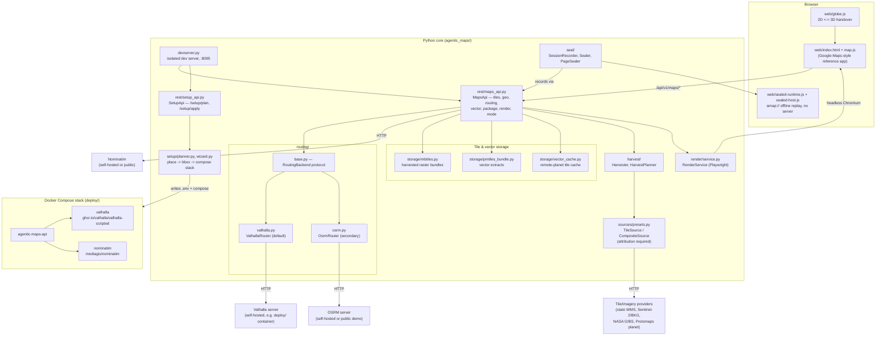

# agentic-maps

**Enabling AI to understand the world.**

An offline-capable, legally-licensed mapping platform: pluggable routing,
always-attributed tile provisioning, multi-DPI static rendering, and a
2-minute self-hosted geo server — all sitting behind one small, dependency-
optional Python core and a vendored MapLibre frontend with no CDN calls.

[](LICENSE)
[](pyproject.toml)
[](#development)
[](#contributing)

---

## Contents

- [What it does](#what-it-does)
- [Quickstart](#quickstart)
- [Architecture](#architecture)
- [The sample app](#the-sample-app)
- [Licensing & attribution](#licensing--attribution)
- [Documentation](#documentation)
- [Roadmap](#roadmap)
- [Development](#development)
- [Contributing](#contributing)

## What it does

| | |
| --- | --- |
| **Pluggable routing** | Car / truck / walk / bike, one canonical vocabulary over two backends — self-hosted **Valhalla** (default: alternates, isochrones, real truck costing) or **OSRM** (secondary/legacy). `/routing/capabilities` reports what the active backend actually honours (avoid-toll/motorway/ferry, alternates, isochrones) so the UI never offers an option that gets silently ignored. Full reference: [`docs/routing.md`](docs/routing.md). |
| **Always-attributed tile provisioning** | Every `TileSource`/`CompositeSource` carries required `attribution`/`license_name`/`license_url` fields — there is no code path that ships a tile without credit. Ships a federated "EU pack" out of the box: all 16 German state 20 cm orthophotos, Sentinel-2/BKG for the rest of central Europe, NASA Blue Marble worldwide, Protomaps/OSM street vectors. See [`docs/imagery-coverage.md`](docs/imagery-coverage.md). |
| **Multi-DPI static rendering** | `POST /render` screenshots the exact live map runtime (same imagery, vectors, routes, highlights as the browser) via headless Chromium, at 1x/2x/3x scale, PNG or JPEG — for docs, print, thumbnails, share cards. See [`docs/rendering.md`](docs/rendering.md). |
| **2-minute geo server** | A CLI wizard (`agentic-maps-setup`) or a web wizard (`web/apps/setup-wizard/`) plan a `docker compose` stack — this API + self-hosted Valhalla + self-hosted Nominatim, scoped to one place — from a place name. Honest about scaling past a small town/city; see [`docs/setup-guide.md`](docs/setup-guide.md). |
| **3-state runtime mode** | `offline` / `mixed` / `online`, server-enforced per request: offline refuses every network-touching endpoint outright, mixed keeps live routing/geocoding/tiles but refuses bulk data provisioning (harvest, vector extract), online allows everything. |
| **Google-Maps-style reference app** | `web/index.html` — search, right-click routing menu, hold-to-zoom, per-country route shields, 25 label languages, a seamless 2D↔3D globe handover, alternates, turn-by-turn, isochrones. See [The sample app](#the-sample-app). |
| **MCP server** | The whole capability surface as agent tools (official MCP SDK): geocoding, multi-stop routing, feature extraction with building heights, map rendering as inline image bytes, attribution, runtime-mode control, offline provisioning — over stdio (`agentic-maps-mcp`) or streamable HTTP at `/mcp` on the dev server. Every tool is a thin in-process adapter over the same REST surface. See [`docs/mcp.md`](docs/mcp.md). |
| **Sealed Sessions** | One exact-match, offline-replayable recording of a live map page — every tile, vector, glyph, route answer it asked for, frozen into a single bundle with no server behind it. A request the recording never saw is refused out loud, not served from a near-enough substitute. See [`docs/sealed-sessions.md`](docs/sealed-sessions.md). |

## Quickstart

Requires Python 3.11+ for the core, REST surface and fallback ladder;
the `dev-server`/`globe`/`debug` extras need Python 3.14+ (their
`llming-stage`/`llming-com` dependencies require it — see
[`docs/development.md`](docs/development.md)).

### Plain dev server

```bash
pip install -e ".[rest,fallback]" "uvicorn[standard]"
agentic-maps-dev
```

Starts the isolated dev server on `http://127.0.0.1:8095` — serves the demo
page (`web/`), the `MapsApi` REST surface, and a built-in demo `MapSpec` so
the map, search, routing and globe all work out of the box (default
`--mode online`; `--mode offline`/`--mode mixed` are also available).
Routing needs a real backend behind it: set `AGENTIC_MAPS_VALHALLA_URL` (or
`AGENTIC_MAPS_ROUTING_BACKEND=osrm` + `AGENTIC_MAPS_OSRM_URL`) at a reachable
server — the dev server does not bundle one itself. See
[`docs/routing.md`](docs/routing.md).

### The 2-minute geo server (routing + geocoding included)

```bash
pip install -e ".[rest,fallback]"
agentic-maps-setup
```

Answers a few prompts (place, runtime mode, travel profiles), then writes
`.env` + a ready `docker compose` stack (this API, self-hosted Valhalla,
self-hosted Nominatim — see [`deploy/docker-compose.yml`](deploy/docker-compose.yml))
and offers to bring it up. A small town/city resolved automatically via
Overpass is genuinely a 2-5 minute round trip; anything larger needs a
Geofabrik PBF you supply yourself — the wizard says so explicitly rather
than let "2 minutes" quietly stop being true. Full walkthrough, verified
image/env-var/port details, and the honest scaling table:
[`docs/setup-guide.md`](docs/setup-guide.md).

### MCP server (agent tools)

```bash
pip install -e ".[rest,fallback,mcp]"
agentic-maps-mcp                 # stdio — point a Claude Code/Desktop MCP config at this
```

The same tools also serve over streamable HTTP at `/mcp` whenever the dev
server starts with the `mcp` extra installed. Tool roster, caps, config
snippets: [`docs/mcp.md`](docs/mcp.md).

## Architecture



The core engine (`agentic_maps/`, minus `rest/`, `devserver.py`, `render/`)
stays framework-free — FastAPI, Playwright and the shared `llming-stage`/
`llming-com` frontend bundle are all optional extras (`pyproject.toml`'s
`[tool.poetry.extras]`), so the routing/storage/harvest/seal logic is
importable and testable with no web framework installed at all.

## The sample app

`web/index.html` (served at `/` by `agentic-maps-dev`) is a Google-Maps-class
reference application built on the same `AgenticMap` runtime any host page
can embed (`data-agentic-map` + a JSON payload):

- Hybrid / Satellite / Map / Dark views, Google-compatible URL state
  (`#@lat,lon,zoomz&view=…`), 25 label languages.
- A merged, scored search (city index + country index + Nominatim), live
  distance chips; the searched place's own basemap label is highlighted and
  rendered exactly once (the stock label is suppressed while the highlight
  stands).
- A right-click menu (Route von hier / Als Zwischenstopp / Route hierhin /
  Hierhin zentrieren) for arbitrary coordinates; a plain left-click opens the
  "route from/to here" info card only on named POIs — clicking open ground
  dismisses what is open rather than dropping a pin.
- Turn-by-turn directions with drawn maneuver glyphs, alternate-route chips
  (click to promote), per-country route shields (German Autobahn hexagons
  included), locate-me with a "you are here" marker.
- A seamless 2D-to-3D globe handover at zoom 4.3, with country/capital/ocean
  labels and limb shading.

The headline demo flow — all four travel modes, alternates, locate-me — is
exercised end-to-end by `tools/verify_directions.py` against a real running
dev server and a real routing backend (not a mock). (Its final plain-click
step still assumes the old click-anywhere pin drop and predates the
POI-only click behavior above.)

## Licensing & attribution

**This is a hard product constraint, not a nice-to-have** (see `AGENTS.md`
and the whole premise of [`docs/imagery-coverage.md`](docs/imagery-coverage.md)):

> A tile source may only become a preset if we are allowed to
> **bulk-download** its tiles, **store** them, and **redistribute** them
> inside a sealed presentation package handed to a third party —
> commercially. Attribution is fine. An API key, a "no caching / no
> derivative storage" clause, or a prohibition on use outside the provider's
> own runtime disqualifies a source outright, however good the imagery is.

Every `TileSource`/`CompositeSource` carries required `attribution`,
`license_name` and `license_url` pydantic fields, so a provider set literally
cannot be constructed without them — there is no code path that ships a tile
without credit rendered on-map. `tile.openstreetmap.org` and commercial-API
scraping (Google/Bing/Esri/EOX tiles) are excluded permanently, by policy.

The full worldwide survey — what's shipped, what's a verified-license
candidate, what's excluded and why — lives in
[`docs/imagery-coverage.md`](docs/imagery-coverage.md).

## Documentation

| Doc | Covers |
| --- | --- |
| [`docs/concept.md`](docs/concept.md) | Architecture, offline contract, the three runtime modes, scene/authoring model |
| [`docs/features.md`](docs/features.md) | Everything the product does today, endpoint-by-endpoint |
| [`docs/routing.md`](docs/routing.md) | Full routing backend reference — `RoutingBackend` protocol, Valhalla/OSRM internals, env vars, endpoints |
| [`docs/imagery-coverage.md`](docs/imagery-coverage.md) | Worldwide tile-source licence survey — the authority on what may ship in a published package |
| [`docs/rendering.md`](docs/rendering.md) | `POST /render` static rendering: design, request/response shapes, throughput, the MapLibre Native upgrade path |
| [`docs/setup-guide.md`](docs/setup-guide.md) | The 2-minute geo server: verified Docker images/env vars/ports, CLI + web wizards, honest scaling table |
| [`docs/mcp.md`](docs/mcp.md) | The MCP server: tool roster with caps and mode gating, stdio config for Claude Code/Desktop, the `/mcp` HTTP mount, the attribution obligation |
| [`docs/sealed-sessions.md`](docs/sealed-sessions.md) | Offline-bundling a live map page into one exact-match, replayable file |
| [`docs/development.md`](docs/development.md) | Local dev environment, optional extras, running the test suite |

## Roadmap

Honestly-labeled open items, harvested from what the docs themselves already
flag as deferred or unverified — not a wishlist invented for this README:

- **Live routing verification.** The routing backends are unit-tested against
  `httpx.MockTransport` fixtures built from real Valhalla/OSRM response
  shapes (`tests/test_routing_backends.py`), and the sealed-session route-key
  derivation has byte-for-byte Python/JS parity tests
  (`tests/test_sealed_runtime_js.py`). Neither the flagship demo's directions
  flow (`tools/verify_directions.py`) nor Sealed Sessions' routing capture
  has been run against a live Valhalla/OSRM instance in this build
  environment — both require a running dev server pointed at a reachable
  backend, which the default `localhost:8002` is not.
- **MapLibre Native renderer.** `POST /render` is currently a
  one-Chromium-tab-per-request Playwright renderer — correct, but not a
  render farm. The documented next step is a MapLibre Native backend
  (no browser, no DOM, style+camera straight to pixels), API-compatible with
  the existing endpoint. Not yet implemented. See "Upgrade path" in
  [`docs/rendering.md`](docs/rendering.md).
- **Per-pixel raster overlay renderer.** Agreed but not built: a
  high-resolution isodistance renderer with an inferno-style ramp and
  elliptic/polygonal falloffs for the reachability/heatmap gallery, beyond
  today's discrete radial/cluster overlays. See `docs/features.md` §4.
- **More licensed imagery presets.** USGS (US), swisstopo, PDOK (NL), IGN
  (FR), PNOA (ES) and Vlaanderen are verified-license candidates, pending
  scale/bbox integration work — see `docs/features.md` §6 and
  [`docs/imagery-coverage.md`](docs/imagery-coverage.md) §2b.
- **Sociodemographic & transit overlays.** Choropleth layers from open data
  (BBSR INKAR, Zensus 2022, GfK Kaufkraft as a licensed drop-in) and
  GTFS-based transit routing/frequency badges are designed
  (`MapDataOverlay`, a planned `transit/` module) but not implemented — see
  `docs/concept.md` §6b/§7.
- **Web setup wizard, live run unverified.** `web/apps/setup-wizard/`
  is written against the documented `llming-stage` Vue/Quasar vendor
  contract. `llming-stage` itself now installs (editable install from the
  private sibling repo, Python 3.14+ — see `docs/development.md`), but the
  wizard page has not been exercised end-to-end against that live install —
  see `docs/setup-guide.md`'s "Using the web wizard" section.

## Development

```bash
python3.14 -m venv .venv   # 3.11+ suffices for this much; 3.14 needed for the globe extras
source .venv/bin/activate
pip install -e ".[rest,fallback]"
pip install pytest pytest-asyncio
pytest tests -q
```

240 tests, no real network/browser/Docker dependency in the default suite —
the sealed-runtime JS parity tests (`tests/test_sealed_runtime_js.py`) need
`node` on PATH and skip cleanly without it; Playwright- and Docker-driven
checks live separately under `tools/verify_*.py`.
See [`docs/development.md`](docs/development.md) for the optional extras
(`render`, `dev-server`/`globe`/`debug`), what each needs, and the
Python-3.14 requirement the `llming-stage`/`llming-com` extras carry.

## Contributing

Conventions (one pydantic model per file, framework-free core, no CDN calls
in the frontend, licensing-as-a-hard-constraint, and more) are documented in
[`AGENTS.md`](AGENTS.md) — read it before sending a change. There is no CI
pipeline configured yet; `pytest tests -q` is the bar a change needs to clear
locally.
