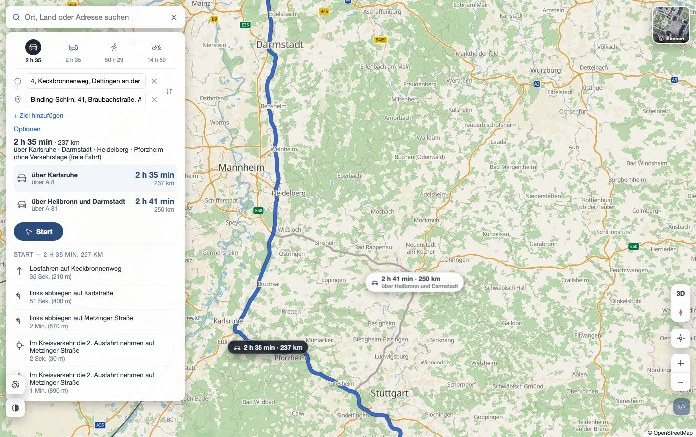
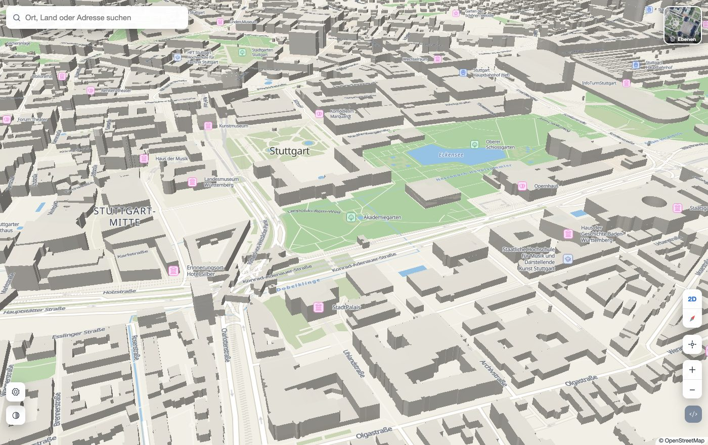
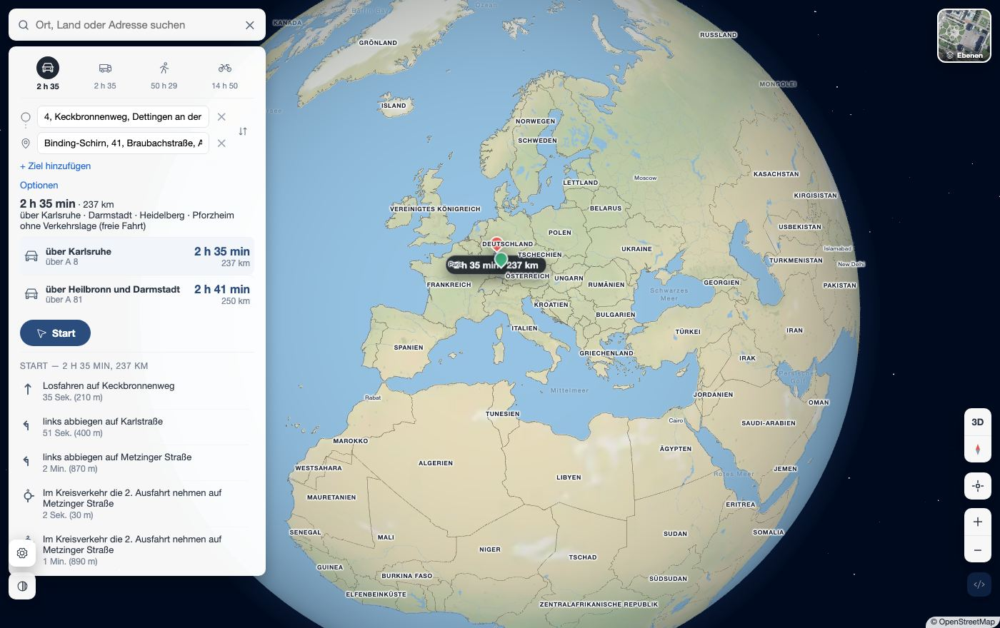
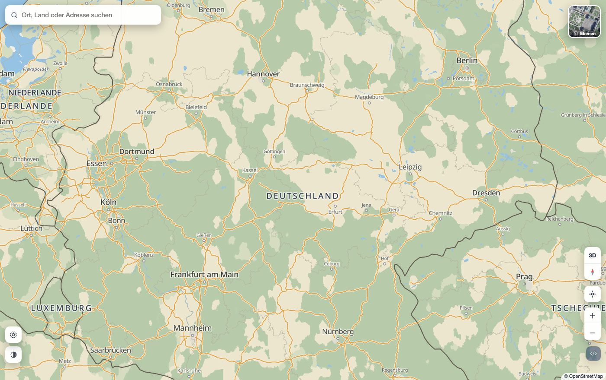
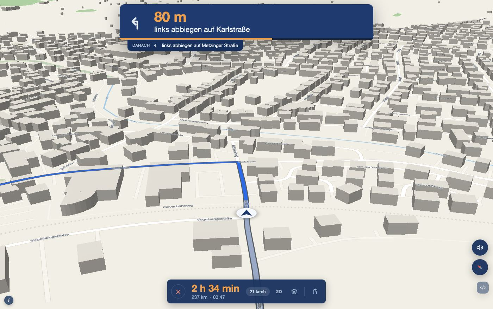
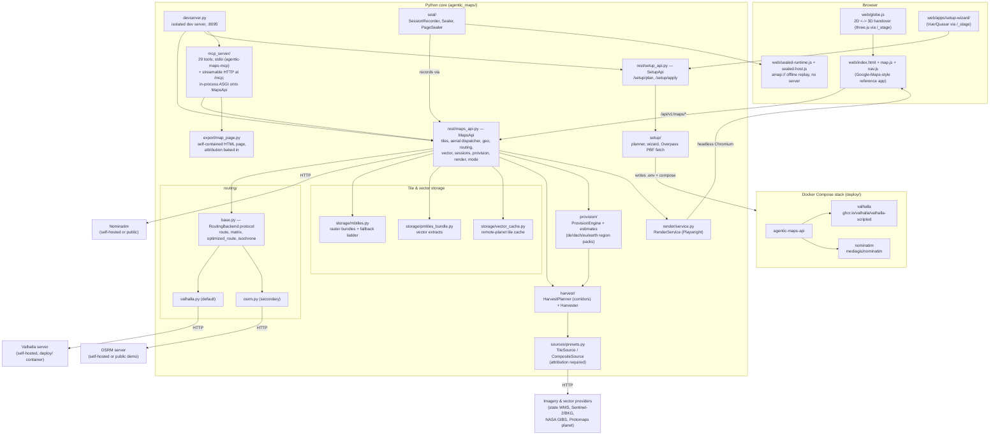

# agentic-maps

**Enabling AI to understand the world.**

An offline-capable, legally-licensed mapping platform: pluggable routing,
always-attributed tile provisioning, professional cartography with a 3D
globe, full turn-by-turn navigation, multi-DPI static rendering, a 29-tool
MCP server, and a 2-minute self-hosted geo server — all behind one small,
dependency-optional Python core and a vendored MapLibre frontend with no
CDN calls.

[](LICENSE)
[](pyproject.toml)
[](#development)
[](#contributing)

| | |
| --- | --- |
|  |  |



---

## Contents

- [What it does](#what-it-does)
- [Screenshots](#screenshots)
- [Quickstart](#quickstart)
- [REST endpoint quick-reference](#rest-endpoint-quick-reference)
- [MCP tool roster](#mcp-tool-roster)
- [Architecture](#architecture)
- [The sample app](#the-sample-app)
- [Licensing & attribution](#licensing--attribution)
- [Documentation](#documentation)
- [Roadmap](#roadmap)
- [Development](#development)
- [Contributing](#contributing)

## What it does

Every claim below is implemented and verified in this tree (file references
inline).

| | |
| --- | --- |
| **Pluggable routing** | Car / truck / walk / bike, one canonical vocabulary over two backends — self-hosted **Valhalla** (default: alternates, isochrones, real truck costing) or **OSRM** (secondary/legacy). Multi-stop routes with per-leg figures and via-place labels ("via Pforzheim", corridor-matched from an offline place index), alternates drawn dimmed and clickable-to-promote, TSP stop ordering via each backend's **native** solver (`POST /route/optimize`), all-pairs travel-time matrices, and one-to-many **reachability** (asymmetric matrix, explicit targets or a server-generated grid). `GET /routing/capabilities` reports what the active backend actually honours so the UI never offers an option that gets silently ignored. Full reference: [`docs/routing.md`](docs/routing.md). |
| **Professional cartography** | The official Protomaps basemap layer set (vendored, restylable flavors) over a custom sage-and-amber palette (`web/road-styles.js`): sage/eucalyptus landcover, steel-leaning water, warm amber motorways — Google-informed hierarchy, our own colours. Per-country route shields generated as SVG (German Autobahn hexagons, French blue autoroutes, green e-roads…), street labels density-sorted from z14, landcover/biome shading down to z<8. |
| **3D globe with biomes** | A seamless 2D↔3D handover at zoom 4.3 (`web/globe.js`): measured camera-distance parity, Natural Earth II-derived biome shading (deserts read as sand, not green), country/capital/ocean labels in 25 languages, limb shading, starfield. |
| **3D buildings & tilt** | Pitch the camera and buildings extrude with real `height`/`min_height` metres from the vector tiles (`web/map.js`, `buildings-3d` layer); the unified aerial dispatcher keeps tilted horizons sharp by serving each distance band from the right zoom of one z0–19 source. |
| **Full navigation** | A Google-style drive mode (`web/nav.js`): heading-up chase cam (2D/3D), instruction HUD with live countdown and "Danach" preview, spoken announcements (speechSynthesis, distance-based), speed-driven auto-zoom with hysteresis, greyed-out traveled path, and a real-speed drive **simulation** engine with pause/fast-forward/jump. |
| **Always-attributed tile provisioning** | Every `TileSource`/`CompositeSource` carries required `attribution`/`license_name`/`license_url` fields — there is no code path that ships a tile without credit. Ships a federated "EU pack": all 16 German state 20 cm orthophotos, Sentinel-2/BKG for central Europe, NASA Blue Marble worldwide (bathymetry-blended oceans), Protomaps/OSM street vectors. See [`docs/imagery-coverage.md`](docs/imagery-coverage.md). |
| **Offline, three ways** | (1) A 3-state runtime mode (`offline`/`mixed`/`online`), server-enforced per request. (2) Whole-region **provisioning presets** (`de`/`dach`/`eu`/`earth` × vector/aerial/routing layers) with a size estimate shown before any download — `de` streets ~168 MB, `de` aerial z13–15 ~15 GB, `earth` base imagery ~1.7 GB; resumable jobs (`agentic_maps/provision/`). (3) **Sealed Sessions**: one exact-match, offline-replayable recording of a live map page, frozen into a single bundle with no server behind it — see [`docs/sealed-sessions.md`](docs/sealed-sessions.md). |
| **MCP server — 29 tools** | The whole capability surface as agent tools (official MCP SDK, `agentic_maps/mcp_server/server.py`): georeferencing, live server-side trips, TSP, reachability, feature extraction with building heights, inline map rendering, attribution, runtime-mode control, offline provisioning — over stdio (`agentic-maps-mcp`) or streamable HTTP at `/mcp`. Every tool is a thin in-process adapter over the same REST surface. See [`docs/mcp.md`](docs/mcp.md) and the [roster below](#mcp-tool-roster). |
| **Multi-DPI static rendering** | `POST /render` screenshots the exact live map runtime via headless Chromium at 1x/2x/3x scale, PNG or JPEG — docs, print, thumbnails, share cards. See [`docs/rendering.md`](docs/rendering.md). |
| **2-minute geo server** | A CLI wizard (`agentic-maps-setup`) or a web wizard plan a `docker compose` stack — this API + self-hosted Valhalla + self-hosted Nominatim, scoped to one place — from a place name, honest about scaling past a small town. See [`docs/setup-guide.md`](docs/setup-guide.md). |
| **25 languages** | Countries, cities, streets and ocean labels all follow `setLanguage(lang)`; Google-compatible URL state carries the choice. |
| **Licensing-first** | The founding constraint, not a feature: only sources whose terms permit bulk download, storage and commercial redistribution may become presets. Complete dependency/license inventory: [`THIRD-PARTY.md`](THIRD-PARTY.md). |

## Screenshots

| | |
| --- | --- |
|  *Country-scale sage & amber cartography* |  *2D↔3D globe handover, live route panel* |
|  *Alternates with via-place labels and badges* |  *3D buildings from real vector-tile heights* |


*Navigation mode: chase cam, instruction HUD, drive simulation*

## Quickstart

Requires Python 3.11+ for the core, REST surface and fallback ladder; the
`dev-server`/`globe`/`debug` extras need Python 3.14+ (their
`llming-stage`/`llming-com` dependencies require it — see
[`docs/development.md`](docs/development.md)).

### Plain dev server

```bash
pip install -e ".[rest,fallback]" "uvicorn[standard]"
agentic-maps-dev
```

Starts the isolated dev server on `http://127.0.0.1:8095` — the demo page
(`web/`), the `MapsApi` REST surface, and a built-in demo `MapSpec`, so the
map, search, routing and globe all work out of the box (default
`--mode online`; `--mode offline`/`--mode mixed` also available). Routing
needs a real backend behind it: set `AGENTIC_MAPS_VALHALLA_URL` (or
`AGENTIC_MAPS_ROUTING_BACKEND=osrm` + `AGENTIC_MAPS_OSRM_URL`) — the dev
server does not bundle one itself. See [`docs/routing.md`](docs/routing.md).

### The 2-minute geo server (routing + geocoding included)

```bash
pip install -e ".[rest,fallback]"
agentic-maps-setup
```

Answers a few prompts (place, runtime mode, travel profiles), then writes
`.env` + a ready `docker compose` stack (this API, self-hosted Valhalla,
self-hosted Nominatim — [`deploy/docker-compose.yml`](deploy/docker-compose.yml))
and offers to bring it up, ending with an optional, skippable offline-data
step (region presets with the size table shown before anything downloads).
A small town/city resolved automatically via Overpass is genuinely a 2–5
minute round trip; anything larger needs a Geofabrik PBF you supply
yourself — the wizard says so explicitly. Full walkthrough, verified
image/env-var/port details, honest scaling table:
[`docs/setup-guide.md`](docs/setup-guide.md).

### MCP server (agent tools)

```bash
pip install -e ".[rest,fallback,mcp]"
agentic-maps-mcp                 # stdio — point a Claude Code/Desktop MCP config at this
```

```json
{
  "mcpServers": {
    "agentic-maps": { "command": "agentic-maps-mcp", "args": ["--mode", "mixed"] }
  }
}
```

The same tools also serve over **streamable HTTP at `/mcp`** whenever the
dev server starts with the `mcp` extra installed; remote clients connect
through a tunnel (cloudflared) in front of `/mcp`, with
`AGENTIC_MAPS_MCP_ALLOWED_HOSTS` widening the SDK's DNS-rebinding
protection — all bytes keep flowing through the server. Tool caps, mode
gating, config details: [`docs/mcp.md`](docs/mcp.md).

## REST endpoint quick-reference

Regenerated from the actual route registrations in
`agentic_maps/rest/maps_api.py` (prefix `/api/v1/maps`),
`rest/setup_api.py` (prefix `/setup`) and `rest/frontend_debug.py`.

| Area | Endpoints |
| --- | --- |
| Tiles & imagery | `GET live/{source}/{z}/{x}/{y}` (cache-through proxy) · `GET aerial/{source}/{z}/{x}/{y}` (unified z0–19 ladder, band-dispatched server-side) · `GET aerial/quality` (how native is the imagery here?) · `GET bundles/{id}/tiles/{z}/{x}/{y}` (sealed bundles + fallback ladder) · `GET attribution` (exact per-view credit line) |
| Sources & bundles | `GET sources` · `GET composites` · `GET bundles` · `GET vector` (local extracts) |
| Geo layers | `GET geo/countries` · `geo/countries/labels` · `geo/countries/search` · `geo/cities` · `geo/cities/search` · `geo/oceans` · `geo/physical` |
| Geocoding | `POST geocode` · `POST reverse-geocode` |
| Routing | `POST route` (multi-stop, alternates, turn-by-turn, via-places) · `POST route/optimize` (TSP) · `POST matrix` (all-pairs or asymmetric via `sources`/`targets`) · `POST isochrone` (Valhalla only) · `GET routing/capabilities` |
| Street vectors | `GET vector/auto/tiles/{z}/{x}/{y}.mvt` (local → remote-planet → cache) · `GET vector/coverage` · `POST vector/extract` · `GET vector/streets` (street survey) · `GET vector/features` (GeoJSON: buildings with heights, roads, POIs, water, landuse) |
| Offline pipeline | `POST plan` (tile count + MB, downloads nothing) · `POST harvest` · `POST harvest-world` · `POST package` (sealed mbtiles+pmtiles+manifest zip) · `POST provision/estimate` · `POST provision` · `GET provision[/{job_id}]` · `POST provision/{job_id}/cancel` |
| Rendering & pages | `POST render` (server-side screenshot, 1x/2x/3x) · `GET render/payload/{token}` · `POST siteplan` (SVG site plan) · `POST sessions` + `GET sessions/{token}[/revision\|/page]` (browser sessions the MCP display tools mint) |
| Cached assets | `GET assets/glyphs/{fontstack}/{range}` · `GET assets/sprites/{path}` |
| Ops | `GET/POST mode` (offline/mixed/online) · `DELETE cache` · `debug/*` (opt-in, key-gated) |
| Setup wizard | `POST /setup/plan` (review-only) · `POST /setup/apply` |

Runtime-mode enforcement is server-side on every request: `offline` refuses
every network-touching endpoint (403), `mixed` keeps live routing/
geocoding/tiles but refuses bulk provisioning (harvest, vector extract,
provision), `online` allows everything.

## MCP tool roster

All 29 tools registered in `agentic_maps/mcp_server/server.py`; caps and
mode dependencies are f-strings over the same constants that enforce them,
so description and behaviour cannot drift. Details: [`docs/mcp.md`](docs/mcp.md).

| Group | Tool | One-liner |
| --- | --- | --- |
| Georeferencing | `geocode` | Place/address → candidates with structured address (postcode included) |
| | `reverse_geocode` | Coordinate → nearest name + structured address |
| | `search_places` | Offline city-index autocomplete merged with bounded live geocoding |
| Routing | `route` | One-shot multi-stop route: geometry, legs, turn-by-turn, via-places, alternates |
| | `route_matrix` | NxN travel-time matrix in minutes |
| | `isochrone` | Reachable-area contour polygons as GeoJSON (Valhalla only) |
| | `optimize_trip` | TSP stop ordering via the backend's native solver, full route in that order |
| | `reachability` | One-to-many minutes from an origin: explicit targets or a server-generated grid |
| | `routing_capabilities` | What the active backend really honours (alternates/isochrone/avoid) |
| Live trips | `create_trip` | Compute a route and keep it alive server-side (bounded LRU store) |
| | `update_trip` | Apply an op list (add/remove/move stop, set options), recompute exactly once |
| | `get_trip` / `list_trips` | Read one trip / inventory the store |
| Display | `open_map_view` | Mint a browser session and open the full map app (one stable, self-updating tab per trip) |
| | `get_map_page_html` | One self-contained HTML document — clickable alternates, attribution baked in, zero third-party references |
| | `render_map` | Screenshot of the real map runtime, returned inline as MCP image content |
| Map content | `extract_features` | GeoJSON from the basemap: buildings (with height m), roads, POIs, water, landuse, places |
| | `street_survey` | Decoded street-line geometry in a bbox |
| Licensing | `list_tile_sources` | All sources/composites with license fields verbatim |
| | `map_attribution` | The exact credit line for a view (per-tile winner resolution) |
| Runtime mode | `get_runtime_mode` / `set_runtime_mode` | Read/switch offline · mixed · online for the whole instance |
| Offline data | `plan_offline_bundle` | Tile count + MB estimate, downloads nothing |
| | `harvest_offline_bundle` | Download a spec's tiles into a local bundle (online mode only) |
| | `package_offline_bundle` | Zip an already-harvested spec; manifest carries the full license list |
| | `list_offline_bundles` | Inventory of local raster bundles + vector extracts |
| | `provision_offline_region` | Whole-region packs (`de`/`dach`/`eu`/`earth`): first call = size estimate only, `confirm_size=true` starts the job |
| | `provisioning_status` / `cancel_provisioning` | Poll honest progress / stop; cancelled jobs are resumable |

## Architecture



The core engine (`agentic_maps/`, minus `rest/`, `devserver.py`, `render/`,
`mcp_server/`) stays framework-free — FastAPI, Playwright, the MCP SDK and
the shared `llming-stage`/`llming-com` frontend bundle are all optional
extras (`pyproject.toml`'s `[tool.poetry.extras]`), so the routing/storage/
harvest/seal/provision logic is importable and testable with no web
framework installed at all.

## The sample app

`web/index.html` (served at `/` by `agentic-maps-dev`) is a
Google-Maps-class reference application built on the same `AgenticMap`
runtime any host page can embed (`data-agentic-map` + a JSON payload):

- Hybrid / Satellite / Map / Dark views, Google-compatible URL state
  (`#@lat,lon,zoomz&view=…`, plus `,Nh`/`,Nt` for bearing/pitch), 25 label
  languages, hold-to-zoom, per-country route shields.
- **Aerial-quality auto-fallback**: viewing far past the best native
  imagery band switches the display to cartography with a toast and
  switches back when coverage returns (3/1 zoom hysteresis — no flapping).
- A merged, scored search (GeoNames city index + country index +
  Nominatim) with live distance chips; the chosen place's own basemap
  label is highlighted and rendered exactly once.
- A right-click menu (route from here / via / to here / center here) for
  arbitrary coordinates; plain left-click opens the info card only on
  named POIs.
- Turn-by-turn directions with drawn maneuver glyphs, alternate-route
  chips (click to promote), via-place labels, locate-me.
- **Navigation mode**: chase cam (2D/3D), spoken German announcements,
  live countdown HUD, and a real-speed drive simulation.
- A seamless 2D-to-3D globe handover at zoom 4.3; 3D buildings with real
  heights when the camera pitches.

The headline demo flow — all four travel modes, alternates, locate-me — is
exercised end-to-end by `tools/verify_directions.py` against a real running
dev server and a real routing backend (not a mock); further Playwright
harnesses under `tools/verify_*.py` cover cartography, navigation, the
globe, offline behaviour, URL state and the aerial fallback.

## Licensing & attribution

**This is a hard product constraint, not a nice-to-have** (see `AGENTS.md`
and the whole premise of [`docs/imagery-coverage.md`](docs/imagery-coverage.md)):

> A tile source may only become a preset if we are allowed to
> **bulk-download** its tiles, **store** them, and **redistribute** them
> inside a sealed offline package handed to a third party — commercially.
> Attribution is fine. An API key, a "no caching / no derivative storage"
> clause, or a prohibition on use outside the provider's own runtime
> disqualifies a source outright, however good the imagery is.

Every `TileSource`/`CompositeSource` carries required `attribution`,
`license_name` and `license_url` pydantic fields, so a provider set
literally cannot be constructed without them — there is no code path that
ships a tile without credit rendered on-map. `tile.openstreetmap.org` and
commercial-API scraping (Google/Bing/Esri/EOX tiles) are excluded
permanently, by policy.

- **[`THIRD-PARTY.md`](THIRD-PARTY.md)** — the complete inventory: every
  vendored library, served asset, Python dependency, dataset, container
  image and system prerequisite, each with version, SPDX license and the
  exact obligation it carries.
- **[`docs/imagery-coverage.md`](docs/imagery-coverage.md)** — the
  worldwide imagery survey: what's shipped, what's a verified-license
  candidate, what's excluded and why.

## Documentation

| Doc | Covers |
| --- | --- |
| [`docs/concept.md`](docs/concept.md) | Architecture, offline contract, the three runtime modes, scene/authoring model |
| [`docs/features.md`](docs/features.md) | Everything the product does today, endpoint-by-endpoint |
| [`docs/routing.md`](docs/routing.md) | Full routing backend reference — `RoutingBackend` protocol, Valhalla/OSRM internals, env vars, endpoints |
| [`docs/imagery-coverage.md`](docs/imagery-coverage.md) | Worldwide tile-source licence survey — the authority on what may ship in a published package |
| [`docs/rendering.md`](docs/rendering.md) | `POST /render` static rendering: design, request/response shapes, throughput, the MapLibre Native upgrade path |
| [`docs/setup-guide.md`](docs/setup-guide.md) | The 2-minute geo server: verified Docker images/env vars/ports, CLI + web wizards, honest scaling table |
| [`docs/mcp.md`](docs/mcp.md) | The MCP server: tool roster with caps and mode gating, offline region provisioning, stdio/HTTP config, the attribution obligation |
| [`docs/sealed-sessions.md`](docs/sealed-sessions.md) | Offline-bundling a live map page into one exact-match, replayable file |
| [`docs/development.md`](docs/development.md) | Local dev environment, optional extras, running the test suite |
| [`THIRD-PARTY.md`](THIRD-PARTY.md) | Every dependency, asset, dataset and container image with license and obligation |

## Roadmap

Honestly-labeled open items, harvested from what the docs themselves flag
as deferred or unverified — not a wishlist. (Previously-open items that
have since shipped: isochrones, TSP stop optimization, route alternates,
one-to-many reachability, region provisioning, live server-side trips, the
MCP surface, live routing against a real backend.)

- **Valhalla-only features, live-verified.** Routing now runs against real
  backends (the demo flow and the screenshots above use live-computed
  routes; OSRM verified including alternates). The Valhalla-exclusive
  surface — isochrones, real truck costing, `avoid` flags — is fully
  implemented and unit-tested against recorded response shapes
  (`tests/test_routing_backends.py`), but still needs an end-to-end pass
  against a self-hosted Valhalla instance.
- **MapLibre Native renderer.** `POST /render` is a
  one-Chromium-tab-per-request Playwright renderer — correct, but not a
  render farm. The documented next step is a MapLibre Native backend
  (no browser, style+camera straight to pixels), API-compatible with the
  existing endpoint. See "Upgrade path" in [`docs/rendering.md`](docs/rendering.md).
- **Per-pixel raster overlay renderer.** Agreed but not built: a
  high-resolution isodistance renderer with an inferno-style ramp and
  elliptic/polygonal falloffs, beyond today's discrete radial/cluster
  overlays. See `docs/features.md` §4.
- **More licensed imagery presets.** USGS (US), swisstopo, PDOK (NL), IGN
  (FR), PNOA (ES) and Vlaanderen are verified-license candidates, pending
  scale/bbox integration work — see [`docs/imagery-coverage.md`](docs/imagery-coverage.md) §2b.
- **Sociodemographic & transit overlays.** Choropleth layers from open
  data (BBSR INKAR, Zensus 2022) and GTFS-based transit routing are
  designed (`MapDataOverlay`, a planned `transit/` module) but not
  implemented — see `docs/concept.md` §6b/§7.
- **Web setup wizard, live run unverified.** `web/apps/setup-wizard/` is
  written against the documented `llming-stage` Vue/Quasar vendor contract
  but has not been exercised end-to-end against a live install — see
  `docs/setup-guide.md`'s "Using the web wizard" section.

## Development

```bash
python3.14 -m venv .venv   # 3.11+ suffices for this much; 3.14 needed for the globe extras
source .venv/bin/activate
pip install -e ".[rest,fallback]"
pip install pytest pytest-asyncio
pytest tests -q
```

**379 tests**, no real network/browser/Docker dependency in the default
suite — the sealed-runtime JS parity tests
(`tests/test_sealed_runtime_js.py`) need `node` on PATH and skip cleanly
without it; Playwright- and Docker-driven checks live separately under
`tools/verify_*.py`. See [`docs/development.md`](docs/development.md) for
the optional extras (`render`, `dev-server`/`globe`/`debug`), what each
needs, and the Python-3.14 requirement the `llming-stage`/`llming-com`
extras carry.

## Contributing

Conventions (one pydantic model per file, framework-free core, no CDN
calls in the frontend, licensing-as-a-hard-constraint, and more) are
documented in [`AGENTS.md`](AGENTS.md) — read it before sending a change.
Enable the repo's content-policy commit gate once per clone:

```bash
git config core.hooksPath hooks
```

There is no CI pipeline configured yet; `pytest tests -q` is the bar a
change needs to clear locally.
